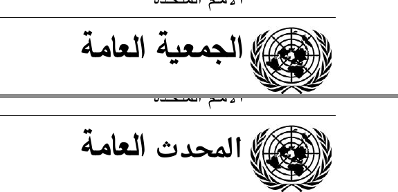
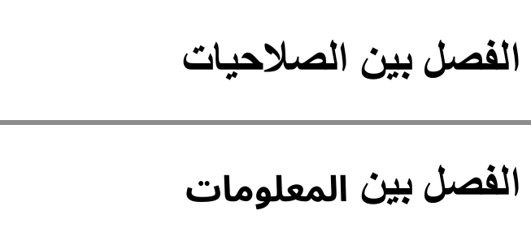
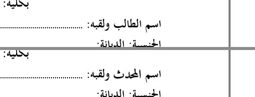
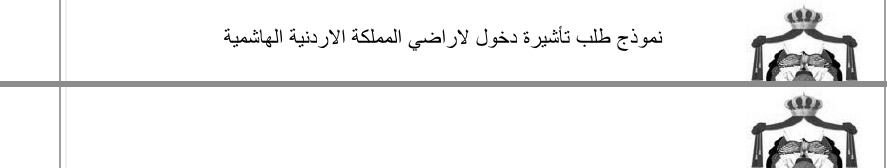
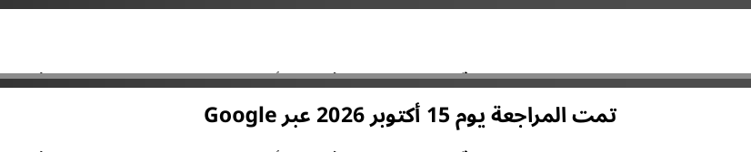
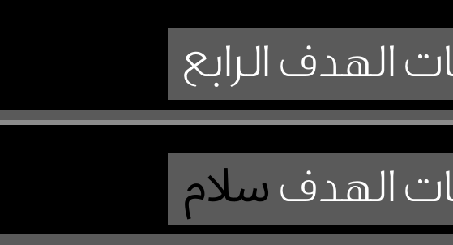
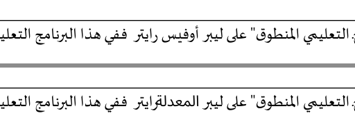
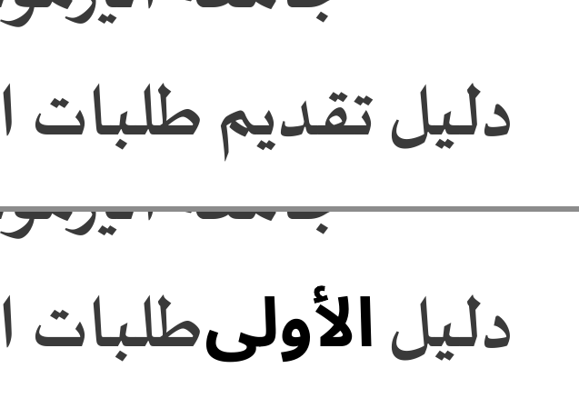

# Étude — éditeur de texte PDF arabe (Lot R)

Date : 05/10/2026. Branche p36. Étude en lecture seule + prototype **local** uniquement.
Rien n'a été mis en ligne, rien n'est annoncé sur le site, aucun appel payant, aucun compte créé.

## 1. Résumé

- La demande des forums arabophones est réelle : modifier le **texte existant** d'un PDF arabe.
- Les outils en ligne grand public ne le font pas ou le disent mal supporté (Sejda l'écrit noir sur blanc).
- Ceux qui le font sont des **applications de bureau** (UPDF, Adobe Acrobat sous Windows).
  Les SDK pro (Nutrient, Apryse) sont sur devis ; Nutrient écrit que son éditeur de contenu ne gère que le texte de gauche à droite.
- Un chemin 100 % sous licences permissives (MIT, Apache-2.0, OFL) **fonctionne** dans le prototype :
  vraie suppression des glyphes d'origine, nouveau texte bien lié, bon ordre, arabe + chiffres + latin, texte trouvable et copiable.
- Mesuré sur 8 PDF de test (LibreOffice et Chrome, 7 polices) : 8/8 sur les cas « mot », « chiffres + mot », « titre gras », « mot avec harakat ».
- Ce qui manque pour un vrai outil : la **remise en page** (le texte voisin ne se décale pas quand le nouveau mot est plus long), l'interface de sélection, et un test sur de **vrais** PDF d'utilisateurs.
- Effort estimé : **20 à 30 jours** pour un outil « remplacer / supprimer / ajouter sur une ligne ». Le réagencement de paragraphes justifiés est en plus.
- **Test sur 37 vrais PDF arabes (P37, 07/10, § 11)** : 10 pays arabes + ONU, OMS, UNESCO, Banque mondiale ; Word, InDesign, Distiller, Acrobat, Chrome, Google Docs, LibreOffice, scans.
  Résultat propre (trouvé, vraiment retiré, nouveau texte trouvable, rendu correct à l'œil) : **remplacer 20/34**, **supprimer 25/33**, **ajouter 34/34** sur les PDF qui ont une couche texte.
  Global **78 %** (79/101) sur ces PDF, **72 %** (79/110) sur tout le corpus. C'est **sous le seuil de 80 %** du § 9.
  La liaison des lettres et l'ordre arabe + chiffres + latin sont justes partout. Les échecs viennent surtout de défauts **corrigeables** du prototype (couleur et gras non recopiés, police de remplacement trop large, texte tourné, regroupement en lignes) ; 3 PDF sur 37 sont des images (scans) et restent hors de portée.
- Recommandation mise à jour : **construire avec des limites annoncées**, en **21 à 28 jours** pour la v1 « ligne » (§ 11.7), avec une porte de sortie : relancer le corpus et viser ≥ 90 % avant toute mise en ligne.

## 2. Les concurrents — faits vérifiés

Toutes les pages ont été lues le **05/10/2026**.
« Vérifié » = lu sur la page officielle de l'éditeur. « Non vérifiable » = la page officielle ne dit rien, ou est inaccessible.

| Outil | Modifier le texte arabe existant ? | Comment | Prix public | Statut |
|---|---|---|---|---|
| **Sejda** | Non pleinement. La page de l'éditeur affiche : « Right to left scripts are not fully supported (eg: Arabic, Hebrew) » et « Complex script alphabets are not supported (eg: Arabic, Devanagari) ». Les PDF scannés ne sont pas modifiables. | En ligne + bureau | Gratuit jusqu'à 200 pages / 50 Mo, 3 tâches/heure ; prix payants non relevés | **Vérifié** — [sejda.com/pdf-editor](https://www.sejda.com/pdf-editor) |
| **iLovePDF** | La page officielle dit qu'on peut « edit existing text in your PDF » (article du 30/05/2025, mis à jour le 27/02/2026). **Aucune mention** de l'arabe ou du sens droite-à-gauche. L'affirmation « ne modifie pas l'arabe existant » vient d'une page **concurrente** (UPDF). | En ligne | Non relevé | Capacité générale **vérifiée** ; limite arabe **non vérifiable** sur la source officielle — [blog edit-pdf-text](https://www.ilovepdf.com/blog/edit-pdf-text), [blog advanced editing](https://www.ilovepdf.com/blog/new-advanced-pdf-editing-ilovepdf) |
| **Smallpdf** | La page officielle dit : « direct text editing is a feature available with a Pro subscription ». **Aucune mention** de l'arabe. La limite arabe vient de la page UPDF. | En ligne, Pro | Prix non affiché sur la page lue | Pro obligatoire **vérifié** ; limite arabe **non vérifiable** — [smallpdf.com/edit-pdf](https://smallpdf.com/edit-pdf) |
| **PDFzorro** | La page d'accueil parle seulement d'ajouter du texte, de « whiteout » (masquer en blanc) et de noircir. Rien sur la modification du texte existant, rien sur l'arabe. | En ligne | Gratuit | **Vérifié** (absence de la fonction) — [pdfzorro.com](https://www.pdfzorro.com/) |
| **UPDF** | Oui, selon UPDF : application de bureau Windows/macOS (+ iOS/Android). La même page reconnaît que leur OCR **ne gère pas l'arabe** (PDF scannés exclus). | Application de bureau | Pro : **49,99 $/an** ou **79,99 $ à vie** (4 appareils) | **Vérifié** sur les pages UPDF (affirmations du vendeur, non testées) — [arabic-pdf-editor](https://updf.com/edit-pdf/arabic-pdf-editor/), [updf-lifetime](https://updf.com/knowledge/updf-lifetime/), [comparatif en ligne](https://updf.com/edit-pdf/arabic-pdf-editor-online/) |
| **Adobe Acrobat** | Oui sous **Windows** : outil « Modifier le PDF » + « Sens du paragraphe : de droite à gauche », options RTL activées par défaut avec les réglages régionaux arabe/hébreu. Les pages d'aide Adobe répondent **403** au robot ; l'info vient des résumés de recherche de ces pages et des forums Adobe. Les forums signalent des problèmes de liaison des lettres. | Application de bureau | Pro : **19,99 $/mois** (annuel payé au mois), 29,99 $/mois sans engagement ; Standard 14,99 $ ; Studio 24,99 $ | Prix **vérifié** — [adobe.com/acrobat/pricing](https://www.adobe.com/acrobat/pricing.html) ; capacité arabe **non vérifiable** directement (403) — [aide Adobe RTL](https://helpx.adobe.com/uk/acrobat/using/asian-cyrillic-right-to-left.html) |
| **Nutrient (PSPDFKit)** | **Non** pour l'arabe : « Currently, the content editor only supports left-to-right (LTR) text » (Web) ; « You can only edit left-to-right (LTR) text » (Android). L'éditeur de contenu est une option de licence. | SDK (navigateur, mobile, serveur) | **Prix sur devis** (« Contact Sales ») | **Vérifié** — [guide Web](https://www.nutrient.io/guides/web/editor/edit-text/), [guide Android](https://www.nutrient.io/guides/android/editor/edit-text/) |
| **Apryse (PDFTron)** | Édition de contenu WYSIWYG dans WebViewer (depuis 10.3) et `ContentReplacer` côté serveur. Le support RTL documenté concerne l'interface, la sélection, la recherche et les annotations. **Rien trouvé** qui confirme l'édition du texte arabe existant ; les pages précises ont répondu 404. | SDK (navigateur, serveur) | **Prix sur devis** (des sites tiers parlent de 10 000 $/an et plus, non vérifié) | Capacité arabe **non vérifiable** — [ContentReplacer](https://sdk.apryse.com/api/web/7.3/PDFNet.ContentReplacer.html), [remplacement de texte](https://docs.apryse.com/web/guides/edit/replace) |
| **PyMuPDF** (exclu) | AGPL ; licence commerciale Artifex **sur devis**, pas de prix public. | Bibliothèque | Sur devis | Exclu par la règle (AGPL) |

À retenir : aucun outil **en ligne** ne promet clairement l'édition du texte arabe existant.
Le seul SDK qui documente le sujet (Nutrient) dit non. Les outils qui le font sont des logiciels de bureau.

## 3. Le moteur Redact actuel (P33/P35)

J'ai lu `app/lib/pdfRedact.js` et `app/tools/pdf-tools/pdf-redact/page.jsx`.
Redact ne retire pas le texte du flux de contenu : il **rasterise** chaque page touchée (image PNG noircie), remplace tout le contenu de la page par cette image, puis réécrit les mots restants en texte invisible Helvetica.
Helvetica ne sait pas écrire l'arabe : après Redact, une page arabe n'est plus cherchable.
Pour un éditeur, la rasterisation est donc exclue (qualité, poids, texte perdu). Il faut une vraie suppression dans le flux de contenu. Le prototype montre qu'elle est faisable avec pdf-lib.

## 4. Le chemin technique (licences permissives)

| Brique | Rôle | Licence (vérifiée dans `package.json` / fichier OFL) |
|---|---|---|
| pdf-lib 1.17.1 | lire / réécrire le PDF, intégrer la police | MIT |
| @pdf-lib/fontkit 1.1.1 | métriques de la police | MIT |
| pdfjs-dist 6.4.299 | contrôle de l'extraction (comme le navigateur) | Apache-2.0 |
| harfbuzzjs 1.6.2 | mise en forme arabe (liaison, lam-alef, harakat, crénage) | MIT |
| bidi-js 1.1.0 | ordre bidirectionnel (arabe + chiffres + latin) | MIT |
| Noto Naskh Arabic, Noto Sans Arabic, Noto Sans/Serif (dépôt notofonts) ; Amiri 1.003 (dépôt aliftype) | police complète pour le nouveau texte | SIL OFL 1.1 |

Tout tourne dans le navigateur : aucun envoi de fichier. Poids à charger : harfbuzz.wasm 434 Ko, bidi-js 12 Ko (minifié), une police arabe 235-250 Ko.

Étapes du prototype (`scripts/audit/results/arabe-proto/arabedit.mjs`, environ 400 lignes) :

1. **Lire le flux de contenu** de la page et interpréter les opérateurs de texte (BT, Tf, Tm, Td, TJ, Tj, cm, q/Q…). On obtient chaque glyphe avec sa position et son texte Unicode (table ToUnicode **et** balises `/ActualText`).
2. **Trouver** la ligne et les mots visés. La recherche se fait de droite à gauche, sans harakat, avec normalisation des formes de présentation. Un repli « squelette sans points » (rasm) existe pour les polices dont la table ToUnicode est fausse.
3. **Supprimer pour de vrai** : les glyphes visés sont retirés des opérateurs TJ/Tj. Un décalage égal à leur largeur est inséré, donc le reste de la ligne ne bouge pas. Ce n'est **pas** un rectangle blanc.
4. **Mettre en forme** le nouveau texte : bidi-js découpe en segments, HarfBuzz met en forme chaque segment (arabe, chiffres, latin avec une police de secours).
5. **Écrire** les glyphes avec une police Type0 Identity-H intégrée, une **CID par couple (glyphe, texte)** et une table CIDToGIDMap. Ainsi un même dessin de base sans points (utilisé pour ف et ق) reçoit deux codes, chacun avec le bon texte dans la ToUnicode.
6. Les **points** et les **harakat** qui sont des glyphes séparés sont dessinés comme des **formes vectorielles** (contour HarfBuzz). Leur texte est porté par la lettre de base. Sans cela, pdftotext coupait la ligne en morceaux.
7. Pour un groupe de plusieurs caractères (lettre + haraka, lam-alef), le texte de la ToUnicode est écrit **à l'envers**. pdftotext et pdf.js retournent tous deux ce texte caractère par caractère ; sans cette inversion on lisait « تنَس » au lieu de « تنسَ » (LibreOffice a le même défaut : il produit « ال » pour « لا »).
8. Taille : si la police d'origine est la même police OFL (Amiri, Noto Naskh), on garde la taille exacte. Sinon, la taille est ajustée pour que l'ancien texte, réécrit dans la nouvelle police, ait la même largeur que l'original (bornes ×0,75 à ×1,35).

## 5. Fichiers de test

- Le dossier `Téléchargements\pdf-arabe-tests` **n'existe pas** (vérifié de nouveau le 05/10).
- **Microsoft Word** : l'automatisation PowerShell COM a **bloqué** (Word ouvert en arrière-plan sans réponse pendant 4 minutes, probablement une fenêtre de démarrage invisible). Je l'ai arrêté. **Aucun PDF Word** n'a été testé.
- **LibreOffice** (`soffice --headless`) : 6 PDF, polices Arial, Times New Roman, Traditional Arabic, Simplified Arabic, Amiri, Noto Naskh Arabic. Polices TrueType simples à 1 octet, PDF balisé.
- **Chrome** (impression PDF sans interface, moteur Skia, le même type de moteur que notre Gotenberg) : 2 PDF, Tahoma et Noto Naskh Arabic. Polices Type0 à 2 octets.
- Contenu : un titre gras, 5 lignes mêlant arabe, chiffres (1250, 0551234567), latin (Microsoft, info@example.com), lam-alef (السلام، لا إله إلا الله) et harakat (بِسْمِ اللَّهِ الرَّحْمَٰنِ الرَّحِيمِ).

Les 7 cas appliqués à chaque PDF :

| Cas | Opération |
|---|---|
| c1 | mot arabe : مارس → أبريل |
| c2 | chiffres + mot : « 1250 وحدة » → « 3400 قطعة » |
| c3 | ligne entière avec latin, chiffres et une haraka : → « عُقد لقاء مع شركة Google في جدة يوم 20 يونيو. » |
| c4 | titre gras : السنوي → الفصلي |
| c5 | suppression seule : « ورحمة الله وبركاته، » |
| c6 | mot dont l'original porte des harakat : الرحيم → الكريم |
| c7 | ajout d'une ligne : « لا تنسَ الموعد: 10 أكتوبر 2026 » |

## 6. Résultats mesurés

Mesures : pdftotext (poppler 25.07) noté **P**, pdf.js 6.4 noté **J** (le moteur des navigateurs Firefox et de notre site).
Comparaison sans harakat, sans espaces, formes de présentation normalisées.
Rendu contrôlé à l'œil sur les PNG produits par pdftoppm.

### 6.1 Tableau par cas (8 PDF chacun)

| Cas | Trouvé | Ancien texte disparu (P / J) | Nouveau texte trouvable (P / J) | Remarque |
|---|---|---|---|---|
| c1 mot | 8/8 | 8/8 / 8/8 | 8/8 / 8/8 | bord droit identique (écart 0,00 pt) |
| c2 chiffres + mot | 8/8 | 8/8 / 8/8 | 8/8 / 8/8 | **chevauchement** du mot voisin sur 2/8 (2,4 et 2,7 pt) |
| c3 ligne mixte | 8/8 | 8/8 / 8/8 | 8/8 / **0/8** | pdf.js remet les segments dans le mauvais ordre ; il échoue **aussi sur l'original** (0/8 trouvé avant) |
| c4 titre gras | 8/8 | 8/8 / 8/8 | 8/8 / 8/8 | chevauchement sur 3/8 (0,2 à 1,5 pt) |
| c5 suppression | 8/8 | 8/8 / 8/8 | — | un **trou** reste dans la ligne (pas de remise en page) |
| c6 mot à harakat | 8/8 | 8/8 / 8/8 | 8/8 / 8/8 | les harakat de l'original sont bien retirées avec le mot |
| c7 ajout | — | — | 8/8 (souple) / 8/8 | en strict, P = 0/8 : pdftotext écrit « 10 : » au lieu de « : 10 ». Un PDF LibreOffice de référence donne la même chose : c'est poppler, pas notre écriture |

Chiffres clés :
- **Liaison des lettres** : correcte sur les 8 PDF (vérifié à l'œil, voir images).
- **Ordre** : correct à l'écran sur 8/8, y compris « Google » et les chiffres dans une ligne arabe.
- **Lam-alef et harakat** dans le nouveau texte : bien dessinés ; copie « لا تنسَ » exacte dans pdftotext ; pdf.js ajoute un espace (« تن سَ »).
- **Vraie suppression** : 8/8 dans les deux extracteurs.
  Contrôle avec un simple rectangle blanc sur le même fichier : l'ancien texte reste extractible pour **5 mots sur 5** (مارس، 1250، Microsoft، السنوي، وبركاته). C'est ce que font les outils « whiteout ».
- **Position** : bord droit et ligne de base identiques à l'original (écart 0 pt).
- **Taille** : quasi identique quand la police d'origine est Amiri ou Noto Naskh (14 → 13,8-14 pt). Ajustée sinon, pour garder la même largeur visuelle : Arial 14 → 11,1-12,6 pt (titre 20 → 15), Traditional Arabic 14 → 10,5-11,7 pt (titre 20 → 17,4).
- **Poids du fichier** : 26-49 Ko → 432-609 Ko. Le prototype intègre les polices **entières** ; un vrai outil doit les réduire (harfbuzzjs fournit `harfbuzz-subset.wasm`, MIT). Gain attendu : quelques dizaines de Ko au lieu de 400-560 Ko.

### 6.2 Images avant / après

LibreOffice, Noto Naskh Arabic (même police réutilisée : rendu identique) :

 

Zoom ligne mixte (c3), avant puis après :

Zoom ligne ajoutée (c7) : lam-alef, fatha, chiffres :

LibreOffice, Arial → Noto Sans Arabic. On voit la **limite** : « قطعةفي » et « الفصلي2025 » se touchent, car le reste de la ligne ne se décale pas :

 

LibreOffice, Traditional Arabic → Amiri :

 

Chrome, Tahoma → Noto Sans Arabic (polices Type0, texte réel porté par `/ActualText`) :

 

## 7. Ce qui marche, ce qui ne marche pas

**Marche (mesuré)**
- Remplacer ou supprimer un mot, un groupe de mots ou une ligne entière, avec vraie suppression.
- Ajouter du texte arabe, avec chiffres et latin, lam-alef et harakat.
- Texte nouveau trouvable et copiable dans pdftotext et pdf.js, au moins aussi bien que l'original.
- PDF LibreOffice (polices simples) et Chrome (polices Type0 + `/ActualText`).

**Découvertes importantes en route**
- LibreOffice et Chrome écrivent le texte des polices « à points séparés » (Noto) dans des balises `/ActualText`, pas dans la ToUnicode. Chrome met même `U+0000` dans la ToUnicode. Sans lire `/ActualText`, la recherche échoue.
- Chrome code certaines lettres avec des variantes persanes (ه médian → U+06BE, ي → U+06CC) : il faut normaliser.
- Désactiver `ccmp` dans HarfBuzz pour avoir une lettre = un glyphe **efface les points** avec les polices Noto (vu à l'image). Mauvaise piste, abandonnée.
- `/ActualText` pour tout le nouveau texte : pdftotext l'inverse (texte à l'envers) et pdf.js l'ignore. Abandonné.

**Ne marche pas / pas traité**
- **Remise en page** : si le nouveau texte est plus long, il chevauche le voisin (mesuré jusqu'à 2,7 pt) ; s'il est plus court ou supprimé, un trou reste. Pas de retour à la ligne, pas de réagencement de paragraphe.
- **Texte justifié** : non traité. Il faudrait recalculer les espaces (ou la kashida) de toute la ligne.
- **PDF scannés** : impossible sans OCR arabe. Notre OCR serveur (Tesseract, P33) gère l'arabe, mais remplacer du texte dans une image est un autre outil.
- **Polices sans ToUnicode ni ActualText**, ou avec une table fausse : la recherche par texte peut échouer. Le repli « squelette sans points » aide mais peut confondre deux mots. Il faudrait alors laisser l'utilisateur **cliquer** sur la zone.
- **Police d'origine en sous-ensemble** : on ne peut pas réutiliser la police intégrée (lettres manquantes, encodage propre au fichier). On réécrit toujours avec une police OFL proche. Si la police d'origine est commerciale (Arial, Traditional Arabic), le rendu change un peu.
- **Gras / italique / couleur** : le prototype choisit la version grasse d'après le nom ; la couleur n'est pas recopiée (noir).
- **Texte dans des Form XObjects**, pages tournées, texte vertical, PDF chiffrés, Word et InDesign : **non testés**.
- **Harakat dans pdf.js** : un espace parasite apparaît avant la lettre vocalisée à la copie.
- **Ligne mixte dans pdf.js** : ordre des segments faux, déjà sur l'original. Ce n'est pas réparable de notre côté.

## 8. Effort estimé pour un outil en production

| Bloc | Jours |
|---|---|
| Interpréteur de contenu robuste (Form XObjects, images en ligne, pages tournées, plusieurs flux, ressources partagées, encodages CMap non Identity, PDF chiffrés) | 4-6 |
| Interface : clic sur une ligne dans l'aperçu pdf.js, sélection de mots, zone de saisie RTL, ajout de texte à un endroit | 4-6 |
| Polices : sous-ensemble (hb-subset), choix de la police proche, gras/italique, couleur d'origine, chargement à la demande | 3-4 |
| Remise en page **sur la ligne** (décaler le reste de la ligne quand la largeur change) | 3-4 |
| Paragraphes : retour à la ligne, justification, kashida | 5-8 (optionnel, v2) |
| Vérification après écriture (comme Redact : relire le fichier, ancien texte absent, nouveau présent), corpus de tests, Safari/iPhone, performance | 4-5 |
| **Total v1 (ligne, sans paragraphes)** | **18-25** |
| **Total avec paragraphes justifiés** | **23-33** |

## 9. Recommandation

**Construire, en deux temps, mais pas encore.**

Pour :
- La partie difficile (suppression réelle, liaison, bidi, texte trouvable) fonctionne déjà sur 8 PDF sur 8.
- Aucun outil **en ligne** ne propose clairement ce service ; Sejda dit ne pas le supporter, Nutrient aussi. Ce serait un vrai avantage pour le public arabophone.
- Coût 0 $ : tout est sous licence MIT / Apache / OFL, tout tourne dans le navigateur, sans serveur.

Contre :
- Mes PDF de test sont **fabriqués** (LibreOffice, Chrome). Pas de PDF Word, pas de PDF réels d'utilisateurs. Les vrais PDF arabes ont souvent des polices aux tables Unicode cassées.
- Sans remise en page, un mot plus long chevauche le voisin. Les utilisateurs le verront tout de suite.

Étapes proposées :
1. Réunir **30 PDF arabes réels** (forums, documents administratifs, PDF Word faits par le propriétaire à la main). Relancer `measure.mjs` dessus. Décider sur ces chiffres.
2. Si plus de 80 % des lignes sont trouvées et réécrites proprement : construire la v1 « ligne » (18-25 jours) avec la remise en page sur la ligne.
3. Annoncer honnêtement les limites sur la page (pas de scans, pas de paragraphes justifiés en v1).

**Mise à jour P37 (07/10)** : l'étape 1 est faite (§ 11). Sur 37 vrais PDF, le taux propre est de **78 %** sur les PDF à couche texte (72 % sur tout le corpus), donc **sous les 80 %**.
Mais les échecs sont presque tous des défauts corrigeables du prototype, déjà identifiés un par un.
Nouvelle recommandation : **construire avec limites annoncées**, v1 « ligne » en **21 à 28 jours** (§ 11.7), et ne mettre en ligne qu'après une nouvelle mesure du corpus à **≥ 90 %**.

## 10. Où sont les fichiers

- Ce rapport : `docs/audit/ETUDE-EDITEUR-PDF-ARABE.md`
- Images : `docs/audit/etude-arabe/` (11 PNG, 15-38 Ko chacun)
- Prototype (dossier ignoré par git, vérifié avec `git check-ignore`) : `scripts/audit/results/arabe-proto/`
  - `arabedit.mjs` (moteur), `run.mjs` (cas et contrôles), `measure.mjs` (mesures + contrôle rectangle blanc)
  - `tests/` (8 PDF + sources .fodt / .html), `out-final/` (PDF modifiés, textes extraits, `table.json`)
  - `fonts/` (polices OFL téléchargées avec leurs fichiers OFL), `package.json` propre au dossier
- Relancer : `cd scripts/audit/results/arabe-proto && node measure.mjs`
- **Test sur corpus réel (P37, § 11)** :
  - Corpus (dossier ignoré par git, vérifié avec `git check-ignore`) : `scripts/audit/results/arabe-corpus/pdfs/` (37 PDF), `sources.csv` (URL, éditeur, pays, date, taille, Producer/Creator, pages, texte extractible, types de polices), `urls.txt`
  - Résultats : `scripts/audit/results/arabe-corpus/out/<id>/` (PDF modifiés, textes extraits, crops avant/après, `result.json`), `results.json`, `corpus-summary.json`, `report.md`, `run.log`, `run2.log`
  - Scripts (dans le prototype) : `corpus.mjs` (exécution et mesures, un processus par PDF), `corpus-report.mjs` (tableau et taux), `sources.mjs` (sources.csv), `dbg.mjs` (diagnostic d'une ligne)
  - Images : `docs/audit/etude-arabe/p37/` (8 PNG, 4-23 Ko)
  - Relancer : `cd scripts/audit/results/arabe-proto && node corpus.mjs && node corpus-report.mjs`

## 11. Test sur 30 vrais PDF arabes (P37, 07/10)

Date : 06-07/10/2026. Branche p37. Tout est local : rien en ligne, rien d'annoncé, aucun appel payant.
Le dossier `Téléchargements\pdf-arabe-tests` **n'existe toujours pas** (vérifié le 06/10). Tous les PDF viennent donc du web public.

### 11.1 Le corpus

- **37 PDF** publics, non confidentiels, téléchargés le 06/10/2026 (moins de 15 Mo chacun). Liste complète : `sources.csv`.
- Pays : Algérie 2, Arabie saoudite 4, Égypte 2, Émirats 1, Jordanie 4, Liban 2, Maroc 3, Oman 2, Qatar 2, Tunisie 2 ; ONU 2, OMS 4, UNESCO 1, Banque mondiale 2, Wikipédia 2, Internet Archive 1, Spoken Tutorial (IIT Bombay) 1.
- Types : formulaires administratifs et universitaires, journaux officiels (Algérie, Maroc), circulaires, résolutions, rapports annuels, couvertures de rapports.
- Logiciels (champs Producer/Creator) : Microsoft Word 14 (2010 à 365), PowerPoint 2, Acrobat PDFMaker pour Word 1, Adobe InDesign / Illustrator / PDF Library 7, Acrobat Distiller 2, Adobe Acrobat 2, Chrome Skia 3 (Wikipédia + Google Docs), LibreOffice 1, logiciel maison (SGG, Algérie) 1, scans Acrobat 2, Producer vide 2.
- Polices : surtout TrueType et CID TrueType ; Type 1C (InDesign, journal officiel algérien) ; Type 3 (1 PDF). 24 PDF ont au moins une police sans table ToUnicode (pages 1-3). Beaucoup de polices ne sont pas intégrées (Word, Distiller).
- Aucun PDF chiffré dans le corpus. Deux PDF trouvés en route ont été retirés : ils n'avaient pas d'arabe.
- Les PDF **réels** faits avec LibreOffice, wkhtmltopdf, TCPDF ou mPDF sont rares sur les sites publics arabes : LibreOffice 1 seul, wkhtmltopdf/TCPDF/mPDF 0 trouvé. Ces sites publient surtout du Word et de l'InDesign.

### 11.2 La méthode

Nouveau script `scripts/audit/results/arabe-proto/corpus.mjs`. Le moteur `arabedit.mjs` n'a **pas** été modifié : on mesure le prototype tel quel.

- Page testée : la première des 10 premières pages qui a au moins 40 lettres arabes dans pdftotext.
- Les cibles viennent du texte de la page elle-même :
  - **Remplacer** : le mot arabe de 3 lettres ou plus le plus fréquent. Le mot de remplacement est pris dans une liste (plusieurs ont un lam-alef : الإلكترونية، السلام، لاحقا…) : celui dont la largeur est la plus proche de l'ancien mot. On teste ainsi l'écriture, pas l'absence de remise en page (déjà connue, § 7).
  - **Supprimer** : la première ligne arabe de 3 à 10 mots (lettres, chiffres, ponctuation simple, pas de latin), contrôlée comme une seule ligne physique (`pdftotext -bbox-layout`).
  - **Ajouter** : « تمت المراجعة يوم 15 أكتوبر 2026 عبر Google », au bord droit du texte, dans la première bande vide de la page (taille du texte de la page, puis 11 pt, puis 9 pt si la place manque).
- Chaque opération part du fichier **d'origine**. Un processus par PDF, délai maximal 180 s : un fichier ne peut pas arrêter la série.
- Correction de mesure, pas de moteur : poppler écrit à l'envers un lam-alef codé sur plusieurs lettres (§ 4.7), par exemple « اإل » pour « الإ ». La cible est corrigée comme un humain la taperait. Le comptage « ancien texte disparu » cherche les deux formes.
- Mesures, par opération :
  - cible trouvée, glyphes vraiment retirés ;
  - ancien texte absent et nouveau texte présent, dans **pdftotext (P)** et **pdf.js (J)** ;
  - lettres absentes de la police (.notdef) ;
  - **pixels changés hors de la zone modifiée** (rendu pdftoppm 150 dpi avant/après) : prouve que rien d'autre n'a bougé ;
  - chevauchement avec le mot voisin, rapport de taille, taille du fichier ;
  - pour l'ajout : la zone était-elle vide avant ;
  - **contrôle à l'œil** des crops avant/après (tous les remplacements, plus de la moitié des suppressions et des ajouts) : liaison des lettres, ordre, couleur, gras.
- « Propre » = toutes les mesures bonnes **et** rendu correct à l'œil.

### 11.3 Résultats PDF par PDF

R = remplacer, S = supprimer, A = ajouter. « — » = pas de cible possible (aucune ligne arabe pure sur la page). « œil » = refusé au contrôle visuel alors que les mesures étaient bonnes.

| # | PDF (page) | Pays / éditeur | Producteur | R | S | A | Cause d'échec |
|---|---|---|---|---|---|---|---|
| 1 | ae-mof-sod (1) | Émirats, ministère des Finances | Word 365 | OK | OK | OK | — |
| 2 | archive-fp14915 | Internet Archive (manuscrit) | scan Acrobat 7 | KO | KO | KO | scan sans couche texte |
| 3 | dz-jo-1975-1 | Algérie, Journal officiel 1975 | scan Acrobat 3 | KO | KO | KO | scan sans couche texte |
| 4 | dz-jo-2025-12 (1) | Algérie, Journal officiel 2025 | SGG (Type 1C) | OK | OK | OK | mineurs : R espace réduit avec le mot suivant ; S un point isolé reste |
| 5 | eg-bu-pg1 (1) | Égypte, univ. Beni Suef | Word 2010 | OK | OK | OK | — |
| 6 | eg-sohag-ph (1) | Égypte, univ. Sohag | Word 2010 | OK | OK | OK | — |
| 7 | emro-rc67 (1) | OMS Méditerranée orientale | Acrobat Pro DC | KO | KO | OK | prototype : ligne de tailles mélangées (36 pt + 9 pt), aucun glyphe retiré |
| 8 | emro-rc72 (1) | OMS Méditerranée orientale | Acrobat 25 | KO (œil) | OK | OK | R : texte blanc gras réécrit en noir normal |
| 9 | jo-mfa-visa (1) | Jordanie, Affaires étrangères | (vide) | OK | OK | OK | — |
| 10 | jo-moh-lecture (1) | Jordanie, ministère de la Santé | Word 2016 | OK | OK | OK | mineur : R mot un peu plus petit (taille ×0,75) |
| 11 | jo-yu-gu (1) | Jordanie, univ. Yarmouk | Word 2010 | OK | OK | OK | — |
| 12 | jo-yu-talabat (1) | Jordanie, univ. Yarmouk | Word 365 | KO | OK | OK | R : Sakkal Majalla très étroite → chevauchement 7,1 pt ; gris devenu noir |
| 13 | lb-abl-annual (1) | Liban, Association des banques | InDesign / PDF Library 15 | KO | KO | OK | couverture : texte tourné à 90°, non géré |
| 14 | lb-ppa-tender (1) | Liban, marchés publics | PDFMaker pour Word | OK | KO | OK | S : ligne « رقم /4ه.ش.ع2022/ » : chiffres et barres, ordre tapé ≠ ordre dessiné |
| 15 | ma-bo-6279 (1) | Maroc, Bulletin officiel | InDesign / PDF Library 10 | KO | KO | OK | R : chevauchement 1,4 pt (Sakkal Majalla) ; S : en-tête à ToUnicode fausse (texte extrait illisible) |
| 16 | ma-bo-7116 (1) | Maroc, Bulletin officiel | InDesign / PDF Library 11 | OK | KO | OK | S : texte dans un Form XObject (encadré), non lu |
| 17 | ma-gdocs-annonce (1) | Maroc, annonce de concours | Google Docs (Skia) | OK | OK | OK | — |
| 18 | om-moh-glimpses2019 (1) | Oman, ministère de la Santé | PowerPoint 2010 | OK | OK | OK | — |
| 19 | om-moh-stats2020 (1) | Oman, ministère de la Santé | (vide) | OK | OK | OK | — |
| 20 | qa-moph-circ12 (1) | Qatar, ministère de la Santé | Word 2013 | OK | OK | OK | — |
| 21 | qa-qu-finaid (1) | Qatar, université | Illustrator / PDF Library 15 | KO (œil) | OK | OK | R : texte blanc sur bandeau réécrit en noir |
| 22 | sa-ksu-12 (2) | Arabie saoudite, univ. King Saud | PowerPoint 2010 | KO (œil) | OK | OK | R : titre gris réécrit en noir |
| 23 | sa-ksu-answer (1) | Arabie saoudite, univ. King Saud | Word 2016 | OK | OK | OK | — |
| 24 | sa-ksu-guide | Arabie saoudite, univ. King Saud | Word 365 | KO | KO | KO | texte arabe en **images** (Word : police non intégrable convertie en image) |
| 25 | sa-nbu-form (1) | Arabie saoudite, univ. Frontières du Nord | Word 2016 | KO | OK | OK | R : le mot visé était caché sous une image ; le nouveau mot apparaît par-dessus ; chevauchement 2,2 pt |
| 26 | spoken-lo-writer (1) | Spoken Tutorial (contenu arabe) | LibreOffice 5.3 | KO | OK | OK | R : Sakkal Majalla → chevauchement 3,7 pt |
| 27 | tn-circ-1977 (1) | Tunisie, circulaire de 1977 | Word 2010 | OK | OK | OK | — |
| 28 | tn-utunis-joussour (6) | Tunisie, univ. de Tunis | Word 2010 | KO | — | OK | R : chevauchement 1,5 pt (Arial) |
| 29 | un-ares-77-1 (1) | ONU, résolution 77/1 | Word 365 | OK | OK | OK | — |
| 30 | un-ares-78-1 (1) | ONU, résolution 78/1 | Word 365 | OK | OK | OK | — |
| 31 | unesco-mapping (1) | UNESCO | InDesign / PDF Library 15 | KO (œil) | OK | OK | R : texte blanc sur fond sombre réécrit en noir |
| 32 | wb-db09 (1) | Banque mondiale, Doing Business 2009 | InDesign → Distiller 9 | KO | KO | OK | couverture : texte tourné à 90°, non géré |
| 33 | wb-ok-content (3) | Banque mondiale | InDesign / PDF Library 10 | KO | OK | OK | R : le premier « البنك » trouvé est **hors de la page** (table de montage InDesign) |
| 34 | who-a65div4 (1) | OMS, Assemblée 65 | Distiller 9 | KO (œil) | KO | OK | R : gras perdu ; S : prototype, ligne coupée en deux groupes |
| 35 | who-b115 (1) | OMS, Conseil exécutif 115 | Distiller 6 | OK | KO | OK | S : prototype, tailles mélangées sur la ligne, aucun glyphe retiré |
| 36 | wiki-ar-egypt (1) | Wikipédia arabe | Chrome Skia | OK | OK | OK | — |
| 37 | wiki-ar-oman (1) | Wikipédia arabe | Chrome Skia | OK | OK | OK | — |

### 11.4 Taux de réussite

| Opération | Propre / tout le corpus | Propre / PDF avec couche texte (34) |
|---|---|---|
| Remplacer un mot | 20/37 = **54 %** | 20/34 = **59 %** |
| Supprimer une ligne | 25/36 = **69 %** | 25/33 = **76 %** |
| Ajouter une phrase | 34/37 = **92 %** | 34/34 = **100 %** |
| **Global** | 79/110 = **72 %** | 79/101 = **78 %** |
| « Lignes trouvées et réécrites » (remplacer + supprimer) | 45/73 = 62 % | 45/67 = 67 % |

Le seuil du § 9 (80 %) **n'est pas atteint**, ni au global ni par opération (sauf l'ajout).

Ce qui marche partout où le moteur trouve la cible :
- **Vraie suppression** : quand des glyphes sont retirés, l'ancien texte disparaît de pdftotext et de pdf.js. Seule exception : le texte hors page (n° 33), où ce n'est pas l'occurrence visible qui a été retirée.
- **Rien d'autre ne bouge** : 0 pixel changé hors de la zone modifiée sur les 93 opérations faites, sauf 14 pixels sur un PDF (bord d'un aplat).
- **Liaison et ordre** : justes sur toutes les images contrôlées, y compris lam-alef, chiffres et « Google » dans une ligne arabe. Aucune lettre absente des polices OFL.
- **Nouveau texte trouvable** : mot remplacé retrouvé 31/32 dans pdftotext et dans pdf.js (l'échec est le cas hors page). Phrase ajoutée : copie exacte dans pdftotext 31/34 ; dans pdf.js tous les mots sont là 34/34, mais dans l'ordre exact 2/34 seulement (même défaut de pdf.js que sur l'original, § 6.1).
- **Temps** : 0,55 s par opération (médiane), 9,7 s au pire (page de 6 000 glyphes).
- **Poids du fichier** : +235 Ko en médiane (polices entières intégrées), jusqu'à ×14,6 sur un petit fichier. Le sous-ensemble de polices (§ 8) est obligatoire.
- **Taille du texte** : 10 remplacements sur 32 touchent la borne ×0,75. Les polices d'origine étroites (Sakkal Majalla, Arabic Typesetting, Simplified Arabic) n'ont pas d'équivalent OFL assez étroit dans le prototype.

### 11.5 Causes d'échec, classées

| Cause | Opérations touchées | Nature |
|---|---|---|
| Couleur (blanc, gris) et gras non recopiés | 5 R | **prototype**, corrigeable (lire la couleur de remplissage et la graisse de la police) |
| Police d'origine plus étroite que la police OFL → chevauchement du voisin | 5 R | **prototype**, corrigeable (police OFL étroite + remise en page sur la ligne, § 8) |
| Regroupement en lignes faux (tailles mélangées, ligne coupée) | 4 (1 R, 3 S) | **prototype**, corrigeable (grouper par ligne de base et par bloc) |
| Texte tourné à 90° (couvertures) | 4 (2 R, 2 S) | **prototype**, corrigeable (matrice de texte tournée) |
| Texte hors de la page trouvé en premier (InDesign) | 1 R | **prototype**, corrigeable (ignorer ce qui sort de la CropBox) |
| Texte dans un Form XObject | 1 S | **prototype**, corrigeable (§ 8, interpréteur) |
| Mot visé caché sous une image | 1 R | à signaler à l'utilisateur (l'aperçu ne montre que le visible) |
| Ligne avec chiffres et barres : ordre tapé ≠ ordre dessiné | 1 S | contourné par une **sélection au clic** au lieu de la saisie |
| ToUnicode fausse (en-tête décoratif) | 1 S | sélection au clic pour supprimer ; ce texte ne peut pas être « cherché » |
| Texte en image (2 scans + 1 Word avec texte en images) | 3 PDF × 3 | **limite de fond** : il faudrait de l'OCR et un autre outil |

Non rencontrés dans ce corpus : PDF chiffré, page avec `/Rotate`, police sans aucune ToUnicode sur le texte visé (les polices sans ToUnicode du corpus servent au latin et aux chiffres, ou sont doublées par une police CID avec ToUnicode).

Si tous les défauts « prototype » étaient corrigés et la sélection faite au clic, il ne resterait que les 3 PDF en image et le mot caché : **environ 95 % estimé** sur ce corpus. C'est une estimation : il faut re-mesurer.

### 11.6 Images avant / après

Chaque image : avant en haut, après en bas (rendu pdftoppm 150 dpi). Crops de documents publics, sans donnée personnelle.

Réussites :

ONU, résolution 78/1 (Word 365) : الجمعية → المحدث, même taille et même gras :

Émirats (Word 365, Arial gras) : « الصلاحيات » trouvé malgré le lam-alef mal extrait par poppler, remplacé par « المعلومات » :

Égypte (Word 2010) : الطالب → المحدث dans un formulaire :

Jordanie (demande de visa) : titre supprimé, rien d'autre ne bouge :

Tunisie (Word 2010) : phrase ajoutée, arabe + chiffres + latin dans le bon ordre :

Échecs typiques :

UNESCO (InDesign) : texte blanc réécrit en noir (couleur non recopiée) :

LibreOffice (Sakkal Majalla) : la police de remplacement est plus large, les mots se touchent :

Jordanie (Word 365, Sakkal Majalla gras gris) : chevauchement de 7 pt et couleur perdue :

### 11.7 Recommandation chiffrée

**Construire avec des limites annoncées.**
Pas « construire » tout court : 78 % est sous le seuil.
Pas « ne pas construire » : la partie difficile (vraie suppression, liaison, bidi, texte trouvable, rien d'autre ne bouge) tient sur 37 vrais PDF, et presque tous les échecs ont une cause précise et corrigeable.

Effort mis à jour (§ 8 corrigé par ce que le corpus a montré) :

| Bloc | § 8 | Après P37 | Pourquoi |
|---|---|---|---|
| Interpréteur robuste | 4-6 | **6-8** | + texte tourné, hors page, regroupement par ligne de base et par bloc, Form XObjects (tous vus ici) |
| Interface (clic sur la ligne, sélection, saisie RTL) | 4-6 | **5-7** | la sélection au clic contourne l'ordre des chiffres et les ToUnicode fausses |
| Polices | 3-4 | **4-5** | + recopie couleur et gras, police OFL étroite (Sakkal Majalla, Arabic Typesetting), sous-ensemble obligatoire (+235 Ko sinon) |
| Remise en page sur la ligne | 3-4 | **3-4** | inchangé ; nécessaire (5 chevauchements) |
| Vérification après écriture, corpus, Safari/iPhone | 4-5 | **3-4** | le banc `corpus.mjs` existe déjà (pixels, P/J) |
| **Total v1 (ligne)** | 18-25 | **21-28 jours** | |
| Paragraphes justifiés (v2, optionnel) | 5-8 | 5-8 | |
| **Total avec paragraphes** | 23-33 | **26-36 jours** | |

Coût d'exploitation : 0 $ (tout dans le navigateur, licences MIT / Apache / OFL).

Conditions :
1. Avant toute mise en ligne, relancer `corpus.mjs` sur ces 37 PDF, **plus** des PDF Word faits à la main et, si possible, de vrais PDF d'utilisateurs. Viser **≥ 90 %** propre sur les PDF à couche texte.
2. Annoncer sur la page : pas de scans ni de texte en image ; la police est remplacée par une police libre proche (le rendu peut changer un peu) ; pas de paragraphes justifiés en v1 ; une ligne à la fois.
3. Détecter et dire clairement « ce PDF est une image » (3/37 ici) au lieu d'échouer en silence.
