# Étude — éditeur de texte PDF arabe (Lot R)

Date : 05/10/2026. Branche p36. Étude en lecture seule + prototype **local** uniquement.
Rien n'a été mis en ligne, rien n'est annoncé sur le site, aucun appel payant, aucun compte créé.

## 1. Résumé

- La demande des forums arabophones est réelle : modifier le **texte existant** d'un PDF arabe.
- Les outils en ligne grand public ne le font pas ou le disent mal supporté (Sejda l'écrit noir sur blanc).
- Ceux qui le font sont des **applications de bureau** (UPDF, Adobe Acrobat sous Windows).
  Les SDK pro (Nutrient, Apryse) sont sur devis ; Nutrient écrit que son éditeur de contenu ne gère que le texte de gauche à droite.
- Un chemin 100 % sous licences permissives (MIT, Apache-2.0, OFL) **fonctionne** dans le prototype :
  vraie suppression des glyphes d'origine, nouveau texte bien lié, bon ordre, arabe + chiffres + latin, texte trouvable et copiable.
- Mesuré sur 8 PDF de test (LibreOffice et Chrome, 7 polices) : 8/8 sur les cas « mot », « chiffres + mot », « titre gras », « mot avec harakat ».
- Ce qui manque pour un vrai outil : la **remise en page** (le texte voisin ne se décale pas quand le nouveau mot est plus long), l'interface de sélection, et un test sur de **vrais** PDF d'utilisateurs.
- Effort estimé : **20 à 30 jours** pour un outil « remplacer / supprimer / ajouter sur une ligne ». Le réagencement de paragraphes justifiés est en plus.
- Recommandation : **construire, mais par étapes**, et seulement après un test sur un corpus réel (voir § 8).

## 2. Les concurrents — faits vérifiés

Toutes les pages ont été lues le **05/10/2026**.
« Vérifié » = lu sur la page officielle de l'éditeur. « Non vérifiable » = la page officielle ne dit rien, ou est inaccessible.

| Outil | Modifier le texte arabe existant ? | Comment | Prix public | Statut |
|---|---|---|---|---|
| **Sejda** | Non pleinement. La page de l'éditeur affiche : « Right to left scripts are not fully supported (eg: Arabic, Hebrew) » et « Complex script alphabets are not supported (eg: Arabic, Devanagari) ». Les PDF scannés ne sont pas modifiables. | En ligne + bureau | Gratuit jusqu'à 200 pages / 50 Mo, 3 tâches/heure ; prix payants non relevés | **Vérifié** — [sejda.com/pdf-editor](https://www.sejda.com/pdf-editor) |
| **iLovePDF** | La page officielle dit qu'on peut « edit existing text in your PDF » (article du 30/05/2025, mis à jour le 27/02/2026). **Aucune mention** de l'arabe ou du sens droite-à-gauche. L'affirmation « ne modifie pas l'arabe existant » vient d'une page **concurrente** (UPDF). | En ligne | Non relevé | Capacité générale **vérifiée** ; limite arabe **non vérifiable** sur la source officielle — [blog edit-pdf-text](https://www.ilovepdf.com/blog/edit-pdf-text), [blog advanced editing](https://www.ilovepdf.com/blog/new-advanced-pdf-editing-ilovepdf) |
| **Smallpdf** | La page officielle dit : « direct text editing is a feature available with a Pro subscription ». **Aucune mention** de l'arabe. La limite arabe vient de la page UPDF. | En ligne, Pro | Prix non affiché sur la page lue | Pro obligatoire **vérifié** ; limite arabe **non vérifiable** — [smallpdf.com/edit-pdf](https://smallpdf.com/edit-pdf) |
| **PDFzorro** | La page d'accueil parle seulement d'ajouter du texte, de « whiteout » (masquer en blanc) et de noircir. Rien sur la modification du texte existant, rien sur l'arabe. | En ligne | Gratuit | **Vérifié** (absence de la fonction) — [pdfzorro.com](https://www.pdfzorro.com/) |
| **UPDF** | Oui, selon UPDF : application de bureau Windows/macOS (+ iOS/Android). La même page reconnaît que leur OCR **ne gère pas l'arabe** (PDF scannés exclus). | Application de bureau | Pro : **49,99 $/an** ou **79,99 $ à vie** (4 appareils) | **Vérifié** sur les pages UPDF (affirmations du vendeur, non testées) — [arabic-pdf-editor](https://updf.com/edit-pdf/arabic-pdf-editor/), [updf-lifetime](https://updf.com/knowledge/updf-lifetime/), [comparatif en ligne](https://updf.com/edit-pdf/arabic-pdf-editor-online/) |
| **Adobe Acrobat** | Oui sous **Windows** : outil « Modifier le PDF » + « Sens du paragraphe : de droite à gauche », options RTL activées par défaut avec les réglages régionaux arabe/hébreu. Les pages d'aide Adobe répondent **403** au robot ; l'info vient des résumés de recherche de ces pages et des forums Adobe. Les forums signalent des problèmes de liaison des lettres. | Application de bureau | Pro : **19,99 $/mois** (annuel payé au mois), 29,99 $/mois sans engagement ; Standard 14,99 $ ; Studio 24,99 $ | Prix **vérifié** — [adobe.com/acrobat/pricing](https://www.adobe.com/acrobat/pricing.html) ; capacité arabe **non vérifiable** directement (403) — [aide Adobe RTL](https://helpx.adobe.com/uk/acrobat/using/asian-cyrillic-right-to-left.html) |
| **Nutrient (PSPDFKit)** | **Non** pour l'arabe : « Currently, the content editor only supports left-to-right (LTR) text » (Web) ; « You can only edit left-to-right (LTR) text » (Android). L'éditeur de contenu est une option de licence. | SDK (navigateur, mobile, serveur) | **Prix sur devis** (« Contact Sales ») | **Vérifié** — [guide Web](https://www.nutrient.io/guides/web/editor/edit-text/), [guide Android](https://www.nutrient.io/guides/android/editor/edit-text/) |
| **Apryse (PDFTron)** | Édition de contenu WYSIWYG dans WebViewer (depuis 10.3) et `ContentReplacer` côté serveur. Le support RTL documenté concerne l'interface, la sélection, la recherche et les annotations. **Rien trouvé** qui confirme l'édition du texte arabe existant ; les pages précises ont répondu 404. | SDK (navigateur, serveur) | **Prix sur devis** (des sites tiers parlent de 10 000 $/an et plus, non vérifié) | Capacité arabe **non vérifiable** — [ContentReplacer](https://sdk.apryse.com/api/web/7.3/PDFNet.ContentReplacer.html), [remplacement de texte](https://docs.apryse.com/web/guides/edit/replace) |
| **PyMuPDF** (exclu) | AGPL ; licence commerciale Artifex **sur devis**, pas de prix public. | Bibliothèque | Sur devis | Exclu par la règle (AGPL) |

À retenir : aucun outil **en ligne** ne promet clairement l'édition du texte arabe existant.
Le seul SDK qui documente le sujet (Nutrient) dit non. Les outils qui le font sont des logiciels de bureau.

## 3. Le moteur Redact actuel (P33/P35)

J'ai lu `app/lib/pdfRedact.js` et `app/tools/pdf-tools/pdf-redact/page.jsx`.
Redact ne retire pas le texte du flux de contenu : il **rasterise** chaque page touchée (image PNG noircie), remplace tout le contenu de la page par cette image, puis réécrit les mots restants en texte invisible Helvetica.
Helvetica ne sait pas écrire l'arabe : après Redact, une page arabe n'est plus cherchable.
Pour un éditeur, la rasterisation est donc exclue (qualité, poids, texte perdu). Il faut une vraie suppression dans le flux de contenu. Le prototype montre qu'elle est faisable avec pdf-lib.

## 4. Le chemin technique (licences permissives)

| Brique | Rôle | Licence (vérifiée dans `package.json` / fichier OFL) |
|---|---|---|
| pdf-lib 1.17.1 | lire / réécrire le PDF, intégrer la police | MIT |
| @pdf-lib/fontkit 1.1.1 | métriques de la police | MIT |
| pdfjs-dist 6.4.299 | contrôle de l'extraction (comme le navigateur) | Apache-2.0 |
| harfbuzzjs 1.6.2 | mise en forme arabe (liaison, lam-alef, harakat, crénage) | MIT |
| bidi-js 1.1.0 | ordre bidirectionnel (arabe + chiffres + latin) | MIT |
| Noto Naskh Arabic, Noto Sans Arabic, Noto Sans/Serif (dépôt notofonts) ; Amiri 1.003 (dépôt aliftype) | police complète pour le nouveau texte | SIL OFL 1.1 |

Tout tourne dans le navigateur : aucun envoi de fichier. Poids à charger : harfbuzz.wasm 434 Ko, bidi-js 12 Ko (minifié), une police arabe 235-250 Ko.

Étapes du prototype (`scripts/audit/results/arabe-proto/arabedit.mjs`, environ 400 lignes) :

1. **Lire le flux de contenu** de la page et interpréter les opérateurs de texte (BT, Tf, Tm, Td, TJ, Tj, cm, q/Q…). On obtient chaque glyphe avec sa position et son texte Unicode (table ToUnicode **et** balises `/ActualText`).
2. **Trouver** la ligne et les mots visés. La recherche se fait de droite à gauche, sans harakat, avec normalisation des formes de présentation. Un repli « squelette sans points » (rasm) existe pour les polices dont la table ToUnicode est fausse.
3. **Supprimer pour de vrai** : les glyphes visés sont retirés des opérateurs TJ/Tj. Un décalage égal à leur largeur est inséré, donc le reste de la ligne ne bouge pas. Ce n'est **pas** un rectangle blanc.
4. **Mettre en forme** le nouveau texte : bidi-js découpe en segments, HarfBuzz met en forme chaque segment (arabe, chiffres, latin avec une police de secours).
5. **Écrire** les glyphes avec une police Type0 Identity-H intégrée, une **CID par couple (glyphe, texte)** et une table CIDToGIDMap. Ainsi un même dessin de base sans points (utilisé pour ف et ق) reçoit deux codes, chacun avec le bon texte dans la ToUnicode.
6. Les **points** et les **harakat** qui sont des glyphes séparés sont dessinés comme des **formes vectorielles** (contour HarfBuzz). Leur texte est porté par la lettre de base. Sans cela, pdftotext coupait la ligne en morceaux.
7. Pour un groupe de plusieurs caractères (lettre + haraka, lam-alef), le texte de la ToUnicode est écrit **à l'envers**. pdftotext et pdf.js retournent tous deux ce texte caractère par caractère ; sans cette inversion on lisait « تنَس » au lieu de « تنسَ » (LibreOffice a le même défaut : il produit « ال » pour « لا »).
8. Taille : si la police d'origine est la même police OFL (Amiri, Noto Naskh), on garde la taille exacte. Sinon, la taille est ajustée pour que l'ancien texte, réécrit dans la nouvelle police, ait la même largeur que l'original (bornes ×0,75 à ×1,35).

## 5. Fichiers de test

- Le dossier `Téléchargements\pdf-arabe-tests` **n'existe pas** (vérifié de nouveau le 05/10).
- **Microsoft Word** : l'automatisation PowerShell COM a **bloqué** (Word ouvert en arrière-plan sans réponse pendant 4 minutes, probablement une fenêtre de démarrage invisible). Je l'ai arrêté. **Aucun PDF Word** n'a été testé.
- **LibreOffice** (`soffice --headless`) : 6 PDF, polices Arial, Times New Roman, Traditional Arabic, Simplified Arabic, Amiri, Noto Naskh Arabic. Polices TrueType simples à 1 octet, PDF balisé.
- **Chrome** (impression PDF sans interface, moteur Skia, le même type de moteur que notre Gotenberg) : 2 PDF, Tahoma et Noto Naskh Arabic. Polices Type0 à 2 octets.
- Contenu : un titre gras, 5 lignes mêlant arabe, chiffres (1250, 0551234567), latin (Microsoft, info@example.com), lam-alef (السلام، لا إله إلا الله) et harakat (بِسْمِ اللَّهِ الرَّحْمَٰنِ الرَّحِيمِ).

Les 7 cas appliqués à chaque PDF :

| Cas | Opération |
|---|---|
| c1 | mot arabe : مارس → أبريل |
| c2 | chiffres + mot : « 1250 وحدة » → « 3400 قطعة » |
| c3 | ligne entière avec latin, chiffres et une haraka : → « عُقد لقاء مع شركة Google في جدة يوم 20 يونيو. » |
| c4 | titre gras : السنوي → الفصلي |
| c5 | suppression seule : « ورحمة الله وبركاته، » |
| c6 | mot dont l'original porte des harakat : الرحيم → الكريم |
| c7 | ajout d'une ligne : « لا تنسَ الموعد: 10 أكتوبر 2026 » |

## 6. Résultats mesurés

Mesures : pdftotext (poppler 25.07) noté **P**, pdf.js 6.4 noté **J** (le moteur des navigateurs Firefox et de notre site).
Comparaison sans harakat, sans espaces, formes de présentation normalisées.
Rendu contrôlé à l'œil sur les PNG produits par pdftoppm.

### 6.1 Tableau par cas (8 PDF chacun)

| Cas | Trouvé | Ancien texte disparu (P / J) | Nouveau texte trouvable (P / J) | Remarque |
|---|---|---|---|---|
| c1 mot | 8/8 | 8/8 / 8/8 | 8/8 / 8/8 | bord droit identique (écart 0,00 pt) |
| c2 chiffres + mot | 8/8 | 8/8 / 8/8 | 8/8 / 8/8 | **chevauchement** du mot voisin sur 2/8 (2,4 et 2,7 pt) |
| c3 ligne mixte | 8/8 | 8/8 / 8/8 | 8/8 / **0/8** | pdf.js remet les segments dans le mauvais ordre ; il échoue **aussi sur l'original** (0/8 trouvé avant) |
| c4 titre gras | 8/8 | 8/8 / 8/8 | 8/8 / 8/8 | chevauchement sur 3/8 (0,2 à 1,5 pt) |
| c5 suppression | 8/8 | 8/8 / 8/8 | — | un **trou** reste dans la ligne (pas de remise en page) |
| c6 mot à harakat | 8/8 | 8/8 / 8/8 | 8/8 / 8/8 | les harakat de l'original sont bien retirées avec le mot |
| c7 ajout | — | — | 8/8 (souple) / 8/8 | en strict, P = 0/8 : pdftotext écrit « 10 : » au lieu de « : 10 ». Un PDF LibreOffice de référence donne la même chose : c'est poppler, pas notre écriture |

Chiffres clés :
- **Liaison des lettres** : correcte sur les 8 PDF (vérifié à l'œil, voir images).
- **Ordre** : correct à l'écran sur 8/8, y compris « Google » et les chiffres dans une ligne arabe.
- **Lam-alef et harakat** dans le nouveau texte : bien dessinés ; copie « لا تنسَ » exacte dans pdftotext ; pdf.js ajoute un espace (« تن سَ »).
- **Vraie suppression** : 8/8 dans les deux extracteurs.
  Contrôle avec un simple rectangle blanc sur le même fichier : l'ancien texte reste extractible pour **5 mots sur 5** (مارس، 1250، Microsoft، السنوي، وبركاته). C'est ce que font les outils « whiteout ».
- **Position** : bord droit et ligne de base identiques à l'original (écart 0 pt).
- **Taille** : quasi identique quand la police d'origine est Amiri ou Noto Naskh (14 → 13,8-14 pt). Ajustée sinon, pour garder la même largeur visuelle : Arial 14 → 11,1-12,6 pt (titre 20 → 15), Traditional Arabic 14 → 10,5-11,7 pt (titre 20 → 17,4).
- **Poids du fichier** : 26-49 Ko → 432-609 Ko. Le prototype intègre les polices **entières** ; un vrai outil doit les réduire (harfbuzzjs fournit `harfbuzz-subset.wasm`, MIT). Gain attendu : quelques dizaines de Ko au lieu de 400-560 Ko.

### 6.2 Images avant / après

LibreOffice, Noto Naskh Arabic (même police réutilisée : rendu identique) :

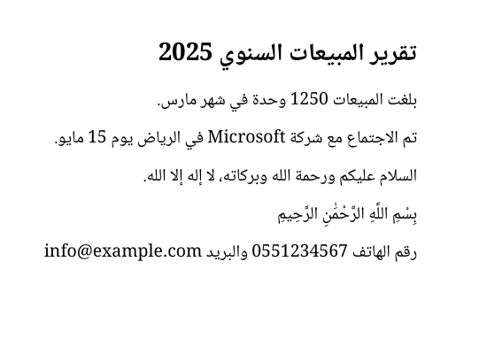 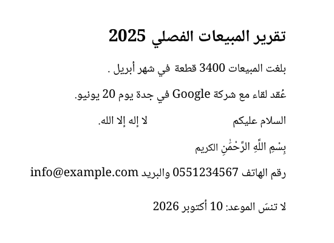

Zoom ligne mixte (c3), avant puis après :

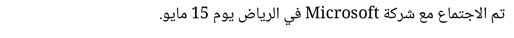
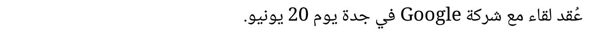

Zoom ligne ajoutée (c7) : lam-alef, fatha, chiffres :

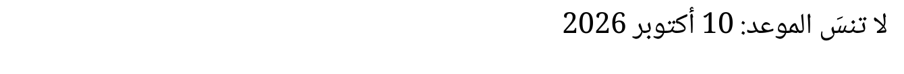

LibreOffice, Arial → Noto Sans Arabic. On voit la **limite** : « قطعةفي » et « الفصلي2025 » se touchent, car le reste de la ligne ne se décale pas :

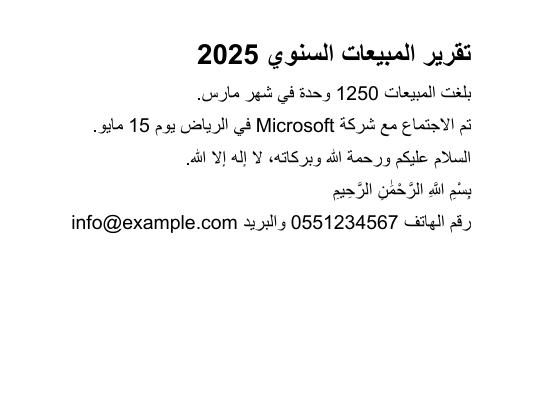 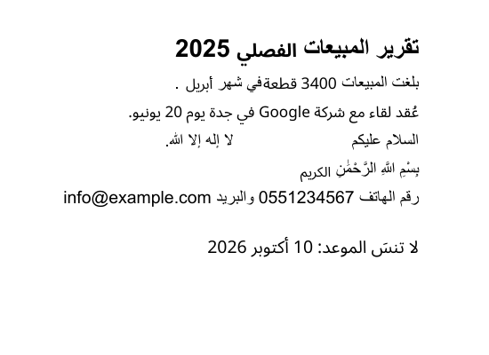

LibreOffice, Traditional Arabic → Amiri :

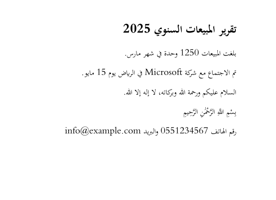 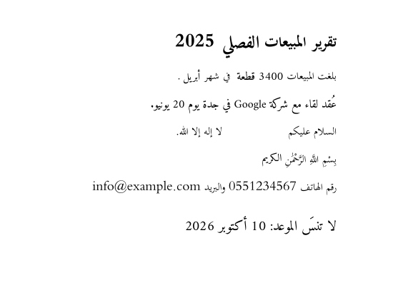

Chrome, Tahoma → Noto Sans Arabic (polices Type0, texte réel porté par `/ActualText`) :

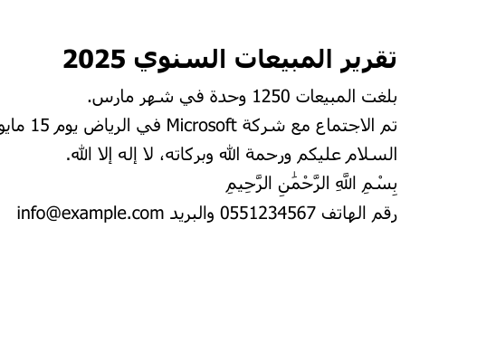 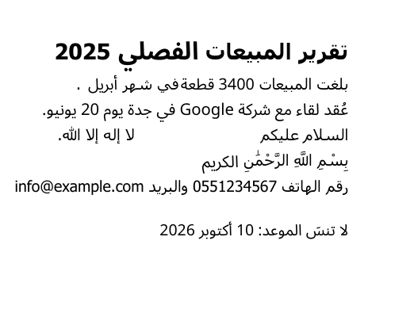

## 7. Ce qui marche, ce qui ne marche pas

**Marche (mesuré)**
- Remplacer ou supprimer un mot, un groupe de mots ou une ligne entière, avec vraie suppression.
- Ajouter du texte arabe, avec chiffres et latin, lam-alef et harakat.
- Texte nouveau trouvable et copiable dans pdftotext et pdf.js, au moins aussi bien que l'original.
- PDF LibreOffice (polices simples) et Chrome (polices Type0 + `/ActualText`).

**Découvertes importantes en route**
- LibreOffice et Chrome écrivent le texte des polices « à points séparés » (Noto) dans des balises `/ActualText`, pas dans la ToUnicode. Chrome met même `U+0000` dans la ToUnicode. Sans lire `/ActualText`, la recherche échoue.
- Chrome code certaines lettres avec des variantes persanes (ه médian → U+06BE, ي → U+06CC) : il faut normaliser.
- Désactiver `ccmp` dans HarfBuzz pour avoir une lettre = un glyphe **efface les points** avec les polices Noto (vu à l'image). Mauvaise piste, abandonnée.
- `/ActualText` pour tout le nouveau texte : pdftotext l'inverse (texte à l'envers) et pdf.js l'ignore. Abandonné.

**Ne marche pas / pas traité**
- **Remise en page** : si le nouveau texte est plus long, il chevauche le voisin (mesuré jusqu'à 2,7 pt) ; s'il est plus court ou supprimé, un trou reste. Pas de retour à la ligne, pas de réagencement de paragraphe.
- **Texte justifié** : non traité. Il faudrait recalculer les espaces (ou la kashida) de toute la ligne.
- **PDF scannés** : impossible sans OCR arabe. Notre OCR serveur (Tesseract, P33) gère l'arabe, mais remplacer du texte dans une image est un autre outil.
- **Polices sans ToUnicode ni ActualText**, ou avec une table fausse : la recherche par texte peut échouer. Le repli « squelette sans points » aide mais peut confondre deux mots. Il faudrait alors laisser l'utilisateur **cliquer** sur la zone.
- **Police d'origine en sous-ensemble** : on ne peut pas réutiliser la police intégrée (lettres manquantes, encodage propre au fichier). On réécrit toujours avec une police OFL proche. Si la police d'origine est commerciale (Arial, Traditional Arabic), le rendu change un peu.
- **Gras / italique / couleur** : le prototype choisit la version grasse d'après le nom ; la couleur n'est pas recopiée (noir).
- **Texte dans des Form XObjects**, pages tournées, texte vertical, PDF chiffrés, Word et InDesign : **non testés**.
- **Harakat dans pdf.js** : un espace parasite apparaît avant la lettre vocalisée à la copie.
- **Ligne mixte dans pdf.js** : ordre des segments faux, déjà sur l'original. Ce n'est pas réparable de notre côté.

## 8. Effort estimé pour un outil en production

| Bloc | Jours |
|---|---|
| Interpréteur de contenu robuste (Form XObjects, images en ligne, pages tournées, plusieurs flux, ressources partagées, encodages CMap non Identity, PDF chiffrés) | 4-6 |
| Interface : clic sur une ligne dans l'aperçu pdf.js, sélection de mots, zone de saisie RTL, ajout de texte à un endroit | 4-6 |
| Polices : sous-ensemble (hb-subset), choix de la police proche, gras/italique, couleur d'origine, chargement à la demande | 3-4 |
| Remise en page **sur la ligne** (décaler le reste de la ligne quand la largeur change) | 3-4 |
| Paragraphes : retour à la ligne, justification, kashida | 5-8 (optionnel, v2) |
| Vérification après écriture (comme Redact : relire le fichier, ancien texte absent, nouveau présent), corpus de tests, Safari/iPhone, performance | 4-5 |
| **Total v1 (ligne, sans paragraphes)** | **18-25** |
| **Total avec paragraphes justifiés** | **23-33** |

## 9. Recommandation

**Construire, en deux temps, mais pas encore.**

Pour :
- La partie difficile (suppression réelle, liaison, bidi, texte trouvable) fonctionne déjà sur 8 PDF sur 8.
- Aucun outil **en ligne** ne propose clairement ce service ; Sejda dit ne pas le supporter, Nutrient aussi. Ce serait un vrai avantage pour le public arabophone.
- Coût 0 $ : tout est sous licence MIT / Apache / OFL, tout tourne dans le navigateur, sans serveur.

Contre :
- Mes PDF de test sont **fabriqués** (LibreOffice, Chrome). Pas de PDF Word, pas de PDF réels d'utilisateurs. Les vrais PDF arabes ont souvent des polices aux tables Unicode cassées.
- Sans remise en page, un mot plus long chevauche le voisin. Les utilisateurs le verront tout de suite.

Étapes proposées :
1. Réunir **30 PDF arabes réels** (forums, documents administratifs, PDF Word faits par le propriétaire à la main). Relancer `measure.mjs` dessus. Décider sur ces chiffres.
2. Si plus de 80 % des lignes sont trouvées et réécrites proprement : construire la v1 « ligne » (18-25 jours) avec la remise en page sur la ligne.
3. Annoncer honnêtement les limites sur la page (pas de scans, pas de paragraphes justifiés en v1).

## 10. Où sont les fichiers

- Ce rapport : `docs/audit/ETUDE-EDITEUR-PDF-ARABE.md`
- Images : `docs/audit/etude-arabe/` (11 PNG, 15-38 Ko chacun)
- Prototype (dossier ignoré par git, vérifié avec `git check-ignore`) : `scripts/audit/results/arabe-proto/`
  - `arabedit.mjs` (moteur), `run.mjs` (cas et contrôles), `measure.mjs` (mesures + contrôle rectangle blanc)
  - `tests/` (8 PDF + sources .fodt / .html), `out-final/` (PDF modifiés, textes extraits, `table.json`)
  - `fonts/` (polices OFL téléchargées avec leurs fichiers OFL), `package.json` propre au dossier
- Relancer : `cd scripts/audit/results/arabe-proto && node measure.mjs`
