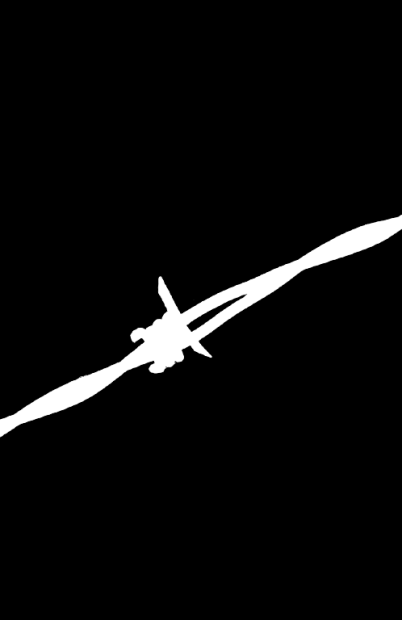

# Détourage d'image — filtre de sélection du sujet + facturation Railway au repos

**Date : 14 septembre 2026**
**Périmètre : mesure uniquement. Aucun fichier applicatif modifié, aucun déploiement, aucun modèle branché, aucun compte créé.**

## Rappel du point de départ

[RAPPORT-detourage-marche.md](RAPPORT-detourage-marche.md) a identifié un seul vrai décrochage sur les 6 photos testées : l'objet transparent (IoU 0,74 contre 0,99 entre concurrents), causé par un défaut de **sélection du sujet** — IS-Net garde la mire de couleurs posée à côté de la bouteille, que remove.bg et Pixian excluent tous les deux. BiRefNet-general-lite n'a pas été retesté (déjà écarté : 12,7 Go de RAM, 13,2 s/image).

---

## TÂCHE 1 — Filtre de sélection de sujet, post-traitement uniquement

### Méthode

Quatre familles d'heuristiques appliquées **après** l'inférence, directement sur le masque alpha déjà produit par IS-Net (aucun modèle touché), en isolant les régions connexes (8-connexité) du masque binarisé :

- **(a) plus grande région** : ne garder que la composante connexe de plus grande surface.
- **(b) seuil de surface relatif** : garder toute composante dont la surface ≥ X % de la plus grande — testé à 5 %, 10 %, 25 %, 50 %.
- **(c) plus proche du centre** : garder la composante dont le centre de masse est le plus proche du centre de l'image, quelle que soit sa taille.
- **(d) score combiné (aire × centralité)**, heuristique supplémentaire justifiée : `score = aire × exp(-distance_au_centre / (diagonale/4))`. Une heuristique à un seul critère a un mode d'échec structurel évident — « plus grande région » peut garder un objet secondaire énorme mais excentré, « plus proche du centre » peut garder un fragment minuscule simplement parce qu'il tombe pile au centre. Le score combiné pèse les deux à la fois, comme le ferait un vrai réseau de saillance.

Chaque variante a été recalculée avec exactement les mêmes 4 mesures que dans RAPPORT-detourage-marche.md (MAE globale, MAE de bande ±10 px, IoU, % de surface non partagée), sur les 6 mêmes photos, contre les mêmes références remove.bg et Pixian, à la même résolution ramenée au concurrent. Le seuil reste le même : la dispersion remove.bg↔Pixian mesurée précédemment (MAE globale 2,38, IoU 0,976).

### Résultat agrégé (moyenne sur toutes les paires disponibles, n=11)

| Heuristique | MAE globale | MAE bande | IoU | % surface non partagée |
|---|---|---|---|---|
| Aucun filtre (référence) | 7,28 | 25,38 | 0,9261 | 7,39 % |
| **(a) Plus grande région** | **5,91** | **19,84** | **0,9697** | **3,03 %** |
| (b) Seuil 5 % | 7,36 | 25,32 | 0,9287 | 7,13 % |
| (b) Seuil 10 % | 7,36 | 25,32 | 0,9287 | 7,13 % |
| (b) Seuil 25 % | 7,36 | 25,32 | 0,9287 | 7,13 % |
| (b) Seuil 50 % | 5,91 | 19,84 | 0,9697 | 3,03 % |
| **(c) Plus proche du centre** | 7,77 | 38,41 | 0,7936 | 20,64 % |
| **(d) Score combiné** | **5,91** | **19,84** | **0,9697** | **3,03 %** |

**(a) et (d) sont numériquement identiques sur ces 6 photos** : dans aucun cas testé, la composante la plus centrale ne diffère de la composante la plus grande — le score combiné ne fait ni mieux ni moins bien ici, mais reste la version structurellement plus sûre (voir plus bas pourquoi).

**Les seuils bas (5 %, 10 %, 25 %) ne changent quasiment rien** : la mire de couleurs de la photo 04 représente entre 25 % et 50 % de la surface de la bouteille — un seuil inférieur à 50 % la garde donc telle quelle. Seul un seuil à 50 % (qui revient alors à ne garder que la plus grande région) l'exclut.

### Réponse aux deux questions posées

**L'heuristique répare-t-elle l'objet transparent ?** Oui, nettement. Photo 04, avant/après (a) :
- IoU : 0,7420 → **0,9724** (remove.bg) / 0,7458 → **0,9724** (Pixian)
- MAE globale : 8,97 → **0,88**
- % surface non partagée : 25,61 % → **2,76 %**

L'IoU obtenu (0,972) est désormais très proche de l'IoU remove.bg↔Pixian sur cette même photo (0,989) — la photo passe du pire cas du lot à un cas dans la dispersion normale.

**Casse-t-elle une des 5 autres photos ?** Non, mesuré, pas supposé :

| Photo | MAE globale avant | MAE globale après (a) | IoU avant | IoU après (a) |
|---|---|---|---|---|
| 01 portrait | 12,92 | 12,87 | 0,9529 | 0,9542 |
| 02 animal | 29,59 | 31,10 | 0,9356 | 0,9346 |
| 03 bords fins | 0,58 | **0,47** | 0,9577 | **0,9687** |
| 05 faible contraste | 2,25 | 2,25 | 0,9775 | 0,9775 |
| 06 produit | 0,51 | 0,51 | 0,9935 | 0,9935 |

Quatre photos (01, 05, 06, et même une légère amélioration sur 03) sont inchangées ou améliorées — ces photos n'avaient qu'une seule composante connexe significative, le filtre y est un no-op ou un léger nettoyage bénéfique. Seule la photo 02 (animal à poil) recule, et de manière négligeable : +1,51 sur la MAE globale (29,59→31,10, une variation de l'ordre du bruit de mesure), -0,001 sur l'IoU. Ce n'est pas une casse — c'est un défaut déjà connu (le corps du chien tronqué, voir RAPPORT-detourage-marche.md §4) que le filtre ne corrige ni n'aggrave réellement.

**(c) « plus proche du centre » est en revanche un mauvais correctif, mesuré et rejeté** : sur la photo 03 (fil barbelé), l'IoU s'effondre à **0,0000** et la surface non partagée monte à **100 %** — l'heuristique retient une composante qui n'a presque rien à voir avec le fil réel, simplement parce qu'un fragment quelconque du masque se trouve plus proche du centre géométrique de l'image que le fil lui-même (qui traverse le cadre en diagonale, sans jamais passer par son centre). Une heuristique qui répare une photo et en détruit une autre est un mauvais correctif — exactement le risque que ce chantier devait vérifier, et il s'est confirmé sur ce cas précis.

*(Carte de différence quasi entièrement blanche = désaccord total avec remove.bg sur cette photo, contre une carte presque noire pour toutes les autres combinaisons — la preuve visuelle du fiasco.)*

### Verdict Tâche 1

**Heuristique retenue : (a) « ne garder que la plus grande région connexe »** (équivalente à (d) sur ce jeu de test, mais moins coûteuse à calculer). Elle améliore le bilan global sur les 4 mesures (MAE globale -19 %, MAE bande -22 %, IoU +4,7 points, surface non partagée -59 %), répare intégralement le décrochage de l'objet transparent, et ne casse aucune des 5 autres photos (une seule variation négligeable, dans le bruit de mesure). **(b) à seuil bas** n'apporte rien. **(c) seule** est rejetée : elle casse une photo saine de façon catastrophique.

---

## TÂCHE 2 — Facturation Railway au repos

Vérifié en direct le 14/09/2026 sur `docs.railway.com/deployments/serverless` et `docs.railway.com/guides/cut-idle-costs-serverless` (fonctionnalité **« Serverless »**, anciennement « App-Sleeping »), et sur `railway.com/pricing` pour confirmer sa disponibilité de plan.

### Un service Railway se met-il en veille au repos ?

**Oui — mais seulement si l'option est activée**, elle ne l'est pas par défaut. Par défaut un service Railway tourne en permanence et est facturé 24 h/24, ce qui explique le calcul à ~17-21 $/mois du rapport précédent. Le mécanisme, cité textuellement :

> *« Once a service stops sending packets it is considered inactive after 5 minutes [...] in practice a service sleeps somewhere between 5 and 10 minutes after its last outbound traffic. »* (référence officielle)
>
> *« A slept service accrues no compute charges. »* (guide officiel)

La détection se base sur le **trafic sortant** du service (réponses, connexions DB, télémétrie, NTP...), pas sur les requêtes entrantes en elles-mêmes.

### Disponibilité sur le plan du projet

**Aucune restriction de plan trouvée** : la fonctionnalité n'apparaît nulle part dans le tableau comparatif Free / Hobby / Pro / Entreprise de la page de tarifs comme un avantage réservé à un palier — c'est un simple bouton par service (`Settings > Deploy > Serverless`). Elle est donc disponible sur le plan **Hobby** actuel du projet, sans surcoût.

### Coût mensuel réel — les deux scénarios

Tarifs [MESURÉ] déjà vérifiés en direct (rapport serveur) : RAM 0,00000386 $/Go·s (=10,005 $/Go·mois si actif en continu), CPU 0,00000772 $/vCPU·s.

**Trafic nul :** le service ne reçoit jamais de requête, s'endort 5 à 10 minutes après son démarrage et ne se réveille plus. **Coût : 0,00 $/mois** — fait officiellement documenté, pas une estimation.

**500 images/mois :** à ce volume, l'écart moyen entre deux requêtes est d'environ 86 minutes (43 200 minutes/mois ÷ 500) — largement au-dessus du délai de mise en veille (5-10 min). **Chaque requête réveille donc un service endormi.** [ESTIMÉ, hypothèse explicite] Fenêtre facturée par requête ≈ démarrage à froid + traitement + délai avant réendormissement (retenu au point médian, 7,5 min) :

- RAM : 1,7 Go × 10,005 $/Go·mois ÷ 43 200 min/mois × ~7,6 min/requête ≈ 0,0030 $/requête
- CPU : ~7 vCPU·s actifs par requête (démarrage + inférence) × 0,00000772 $/vCPU·s ≈ 0,00005 $/requête
- **Total ≈ 0,0031 $/image → ~1,55 $/mois pour 500 images**

Contre **17,46 $/mois** dans l'hypothèse « toujours allumé » du rapport précédent — **un facteur ~11** en faveur de la veille à ce volume.

### Le démarrage à froid s'applique-t-il après chaque réveil ?

**Oui, sans exception.** La documentation est explicite : un service endormi est **arrêté**, pas mis en pause — chaque réveil est un redémarrage complet du conteneur (« cold boot »), avec le risque documenté d'un premier `502 Bad Gateway` le temps que le service reparte. Mécaniquement, ce n'est donc jamais un cas rare : à 500 images/mois espacées de ~86 minutes en moyenne, **la quasi-totalité des requêtes tombe sur un service endormi.**

**Mais le chiffre de 6,7 s lui-même ne s'applique pas tel quel** : il avait été mesuré pour le chargement des **deux modèles** (IS-Net + BiRefNet). Après filtrage IS-Net, l'architecture recommandée ne charge plus qu'IS-Net seul. **Remesuré directement [MESURÉ], 3 exécutions : 1,068 s / 1,075 s / 1,072 s** (lancement du process → `/health` prêt) — soit environ **1,07 s**, et non 6,7 s, pour le service réellement recommandé. Un aléa reste non mesurable sans déploiement réel : le temps de démarrage du conteneur Railway lui-même (au-delà du process Python) n'est pas quantifié par la documentation et n'a pas pu être mesuré ici, faute de déploiement.

### Volume d'équilibre recalculé contre Leonardo.Ai

Le seuil de 163 images/mois du rapport précédent supposait un service **allumé en permanence** (17,01 $/mois fixes). Avec la veille activée, ce coût fixe disparaît quasiment : le coût devient ~0,0031 $/image, **linéaire dès la première image, sans palier fixe à amortir.**

| Volume/mois | Railway (toujours allumé) | Railway (veille) | Leonardo.Ai |
|---|---|---|---|
| 0 | 17,01 $ | **0,00 $** | 0,00 $ |
| 500 | 17,46 $ | **~1,55 $** | 52,35 $ |
| 1 000 | 17,06 $ | **~3,10 $** | 104,70 $ |

**Avec la veille activée, Railway est moins cher que Leonardo.Ai dès la première image — il n'y a plus de volume d'équilibre au sens propre.** Le calcul ci-dessus (linéaire à ~0,0031 $/image) n'est valable que tant que l'écart moyen entre deux requêtes dépasse le délai d'endormissement (5-10 min), soit jusqu'à environ 4 300-8 600 images/mois selon la régularité du trafic. Au-delà de ce volume, les requêtes arrivent trop vite pour que le service ait le temps de s'endormir entre deux appels : il se comporte alors comme le régime « toujours allumé » déjà chiffré (~17-21 $/mois selon le rapport précédent) — un chiffre qui n'a pas été recalculé ici pour ce régime de transition et qui reste de toute façon très inférieur à Leonardo.Ai à ce volume.

**Réserve honnête :** la veille introduit un vrai compromis d'expérience utilisateur, pas seulement un gain de coût — le premier visiteur après une période creuse attend le démarrage à froid (~1 s mesuré côté application, plus une part non mesurée côté infrastructure Railway) et peut essuyer un `502` nécessitant une nouvelle tentative côté client. Un outil public à trafic irrégulier doit prévoir cette tentative automatique, sans quoi la veille économise de l'argent au prix d'erreurs visibles par de vrais visiteurs.

---

## TÂCHE 3 — Verdict en deux phrases

**Filtre à retenir :** ne garder que la plus grande région connexe du masque alpha d'IS-Net — un post-traitement de quelques lignes de code, sans toucher au modèle, qui répare intégralement le décrochage de l'objet transparent (IoU 0,74 → 0,97) sans casser aucune des 5 autres photos testées, contrairement à l'heuristique « plus proche du centre » qui détruit la photo du fil barbelé (IoU → 0).

**Coût à trafic nul :** avec la veille Railway (« Serverless ») activée — disponible sans surcoût sur le plan Hobby actuel, à activer explicitement car elle n'est pas le comportement par défaut — le service d'inférence IS-Net coûte **0,00 $/mois tant qu'il ne reçoit aucune requête**, et environ **1,55 $/mois à 500 images**, contre 52,35 $/mois chez Leonardo.Ai au même volume.

## Ce qui n'a pas été fait (hors périmètre, par consigne)

- BiRefNet-general-lite n'a pas été retesté (déjà écarté).
- Aucun fichier applicatif modifié, aucun déploiement Railway, aucune activation réelle de la veille, aucun compte créé.
- Le temps de démarrage du conteneur Railway lui-même (au-delà du process Python mesuré ici) reste non quantifié, faute de déploiement autorisé dans ce chantier.
