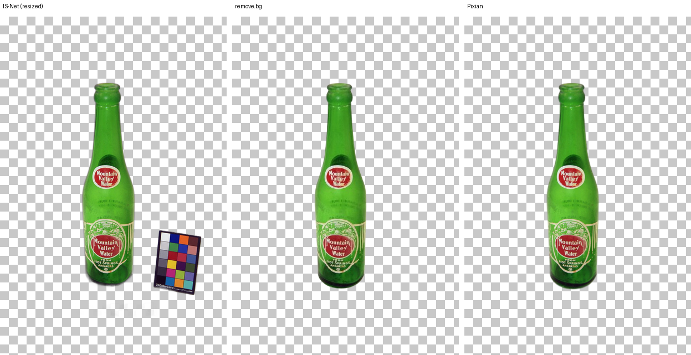
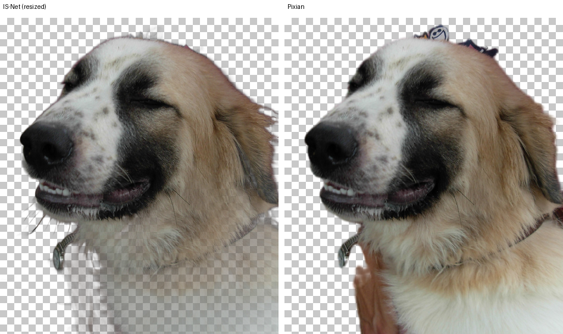

# Détourage d'image — IS-Net general-use face au marché, mesuré

**Date : 13 septembre 2026**
**Périmètre : mesure uniquement. Aucun fichier applicatif modifié, aucun déploiement, aucun modèle branché, aucun compte créé.**

## 0. Question posée

Le [rapport serveur](RAPPORT-detourage-serveur.md) a établi qu'IS-Net general-use tourne côté serveur en ~2,4 s/image, ~1,7 Go de RAM, licence Apache-2.0, sortie pixel-identique au navigateur. Reste une question, et une seule : **sa qualité est-elle au niveau de ce que le marché produit aujourd'hui ?** Ce chantier y répond par la mesure, pas par le jugement visuel — sur les 6 mêmes photographies que tous les chantiers précédents.

## 1. Méthode

Les 6 photos ont été déposées dans l'interface web publique de chaque service testé, via un événement de dépôt de fichier simulé par script (`DragEvent` + `DataTransfer`, le mécanisme de dépôt que ces sites annoncent eux-mêmes) — jamais de clic sur un sélecteur de fichier natif (hors de portée de l'automatisation), jamais de compte créé, jamais de CAPTCHA contourné.

**Services testés avec succès :**
- **remove.bg** — dépôt sans connexion ; le service propose toujours une prévisualisation gratuite basse résolution (~0,25 mégapixel) sans consommer de crédit, confirmé en direct.
- **Pixian.ai** — dépôt sans connexion, plan gratuit également plafonné à 0,25 mégapixel.

**Services non testables :**
| Service | Motif |
|---|---|
| Erase.bg | Exige une inscription pour obtenir des crédits d'essai (« Sign up today to avail your first 3 free credits! ») — aucun mode d'essai sans compte détecté. |
| PhotoRoom | La zone de dépôt réagit à l'entrée du curseur (overlay « Drop your image ») mais n'accepte pas l'événement de dépôt simulé par script — reste bloquée sur l'overlay. Le bouton d'upload alternatif ouvre un sélecteur de fichier natif, hors de portée de cet outil d'automatisation. Non testable sans compte ni interaction manuelle. |
| Adobe Express, Canva | Non tentés — flux de connexion obligatoire dès la page d'entrée du côté observé lors du chantier précédent. |

**remove.bg a par ailleurs échoué net sur une image du lot** (voir §4) — un résultat en soi, pas une exclusion méthodologique.

Les deux services testés avec succès atterrissent, à chaque fois, exactement sur la **même résolution de sortie** l'un que l'autre pour une même photo (ex. 408×611 pour le portrait) — plafond de 0,25 MP identique des deux côtés. La sortie IS-Net (pleine résolution) a donc été redimensionnée vers cette même taille (Lanczos) avant toute comparaison, comme demandé — jamais de pleine résolution comparée à une prévisualisation.

## 2. Les 4 mesures, sur le canal alpha

Pour chaque paire de services et chaque photo :
- **MAE globale** (0–255) : écart absolu moyen sur tout le canal alpha.
- **MAE de bande** (0–255) : écart absolu moyen restreint à une bande de ±10 px autour du contour du sujet (dilatation/érosion par fenêtre 21×21) — c'est la zone qui décide (cheveux, poils, bords fins), pas le centre du sujet.
- **IoU** des masques binarisés (seuil 127).
- **% de surface** gardée par l'un et pas par l'autre, rapporté à l'union des deux masques — révèle les trous bouchés et les morceaux mangés.

### Résultats complets

| Photo | Paire | MAE globale | MAE bande | IoU | Surface A\B | Surface B\A |
|---|---|---|---|---|---|---|
| 01 portrait | IS-Net ↔ remove.bg | 10.52 | 39.76 | 0.9643 | 3.14% | 0.44% |
| 01 portrait | IS-Net ↔ Pixian | 15.33 | 54.77 | 0.9416 | 5.35% | 0.48% |
| 01 portrait | remove.bg ↔ Pixian | 9.15 | 46.27 | 0.9524 | 3.49% | 1.27% |
| 02 animal | IS-Net ↔ Pixian *(remove.bg indisponible, §4)* | 29.59 | 59.68 | 0.9356 | 0.91% | 5.54% |
| 03 bords fins | IS-Net ↔ remove.bg | 0.59 | 5.92 | 0.9534 | 4.64% | 0.02% |
| 03 bords fins | IS-Net ↔ Pixian | 0.57 | 5.70 | 0.9619 | 2.97% | 0.83% |
| 03 bords fins | remove.bg ↔ Pixian | 0.42 | 4.32 | 0.9653 | 0.48% | 2.99% |
| 04 transparent | IS-Net ↔ remove.bg | **9.03** | **40.92** | **0.7420** | **24.60%** | 1.21% |
| 04 transparent | IS-Net ↔ Pixian | **8.92** | **40.10** | **0.7458** | **24.00%** | 1.42% |
| 04 transparent | remove.bg ↔ Pixian | 0.31 | 4.10 | 0.9889 | 0.06% | 1.05% |
| 05 faible contraste | IS-Net ↔ remove.bg | 2.31 | 11.55 | 0.9761 | 2.15% | 0.24% |
| 05 faible contraste | IS-Net ↔ Pixian | 2.19 | 11.03 | 0.9789 | 1.36% | 0.74% |
| 05 faible contraste | remove.bg ↔ Pixian | 1.60 | 9.13 | 0.9820 | 0.26% | 1.54% |
| 06 produit | IS-Net ↔ remove.bg | 0.49 | 4.54 | 0.9943 | 0.39% | 0.18% |
| 06 produit | IS-Net ↔ Pixian | 0.54 | 5.16 | 0.9927 | 0.72% | 0.01% |
| 06 produit | remove.bg ↔ Pixian | 0.40 | 5.14 | 0.9902 | 0.73% | 0.24% |

(A\B = zone gardée par le premier service de la paire et pas le second, en % de l'union des deux masques ; B\A l'inverse.)

## 3. Le critère de décision — la dispersion du marché comme seuil

Agrégation sur toutes les paires disponibles :

| | n paires | MAE globale moy. | MAE bande moy. | IoU moy. | % surface sym. moy. |
|---|---|---|---|---|---|
| **IS-Net ↔ marché** (remove.bg ou Pixian) | 11 | **7.28** | **25.38** | **0.9261** | **7.39%** |
| **Marché ↔ marché** (remove.bg ↔ Pixian) | 5 | **2.38** | **13.79** | **0.9758** | **2.42%** |

**L'écart IS-Net↔marché est en moyenne ~3 fois plus grand que l'écart marché↔marché** (MAE globale : ×3,1 ; surface symétrique : ×3,1 ; MAE de bande : ×1,8 ; IoU : 0.926 contre 0.976). Sur la seule moyenne globale, IS-Net est donc **en dessous** de la dispersion normale du marché — mais cette moyenne masque un partage très net entre les photos :

- **Portrait (01), bords fins (03), faible contraste (05), produit (06)** : l'écart IS-Net↔marché est du même ordre de grandeur que l'écart remove.bg↔Pixian (rapport 1,2× à 1,4× selon la photo, sauf la bande sur le portrait qui est même *dans* l'intervalle remove.bg↔Pixian). **Sur ces 4 photos, IS-Net est dans la dispersion normale du marché.**
- **Objet transparent (04)** : IoU IS-Net↔marché de 0,74 contre IoU remove.bg↔Pixian de 0,99 — un écart d'environ **10× à 30×** selon la mesure. **Nettement en dessous**, avec une cause identifiable (§4).
- **Animal à poil (02)** : remove.bg ayant échoué sur cette image, aucune mesure marché↔marché n'est disponible pour appliquer le test de dispersion. Le défaut visuel (§4) est réel mais ne peut pas être quantifié contre une référence marché faute d'un second service exploitable sur cette image précise — limite méthodologique assumée, pas un résultat maquillé.

**Une phrase :** IS-Net est dans la dispersion normale du marché sur 4 des 6 cas testés (portrait, bords fins, faible contraste, produit), mais tombe nettement en dessous sur l'objet transparent (IoU 0,74 contre 0,99 entre concurrents) et laisse un doute non tranchable sur l'animal à poil faute de second point de comparaison marché — donc « au niveau la plupart du temps, mais pas encore de façon fiable sur tous les cas ».

## 4. Ce qui est raté, concrètement

**04 — Objet transparent (la plus grosse anomalie) :** IS-Net garde la mire de couleurs posée à côté de la bouteille ; **remove.bg et Pixian l'excluent tous les deux**, correctement, en ne gardant que la bouteille comme sujet unique. C'est exactement la source des 24,6 % de surface en trop et de l'IoU à 0,74 — une faiblesse de sélection du sujet principal (saillance) quand plusieurs objets de taille comparable partagent le cadre, pas un défaut de bord.

**02 — Animal à poil :** IS-Net **tronque le bas de l'image** — le poitrail, le collier et la laisse du chien s'effacent en dégradé translucide au lieu de rester pleins, alors que Pixian conserve la totalité du cou, du collier et du poitrail jusqu'au bord du cadre. remove.bg, de son côté, a échoué net sur cette photo (voir ci-dessous) et ne fournit aucune référence de comparaison.

**remove.bg — échec total sur l'image 02 :** en déposant la photo du chien, remove.bg a répondu *« We're sorry, we couldn't remove the background »* et n'a produit aucune image exploitable, même en proposant un rattrapage manuel (« Magic Brush »). Un rappel utile : même le service de référence historique du marché échoue parfois net, pas seulement « moins bien ».

**Cartes de différence** (grises = accord, blanches = désaccord), une par photo et par paire, disponibles dans [`detourage-marche/cartes-diff/`](detourage-marche/cartes-diff/) — la carte `04_objet_transparent__isnet_vs_removebg.png` rend le rectangle de la mire de couleurs visible d'un coup d'œil ; la carte `06_produit_fond_blanc__isnet_vs_removebg.png` est quasiment entièrement noire, confirmant l'équivalence sur ce cas.

**01, 03, 05, 06 :** aucun défaut qualifiable de « raté » — les écarts mesurés restent dans la même fourchette que celle qui sépare déjà remove.bg de Pixian entre eux (voir §3), c'est-à-dire le bruit normal de deux détoureurs compétents face aux mêmes cheveux fins, au même fil de fer ou au même produit sur fond blanc.

## 5. Ce qui n'a pas été fait (hors périmètre, par consigne)

- Aucun compte créé, sur aucun site.
- Aucun CAPTCHA contourné, aucune protection anti-robot déjouée.
- Aucun fichier applicatif modifié, aucun déploiement, aucun modèle branché.
- PhotoRoom, Adobe Express et Canva n'ont pas pu être mesurés (motifs au §1) ; élargir la comparaison à ces services demanderait soit une action manuelle du propriétaire du site, soit un compte de test qu'il choisirait de créer lui-même.
